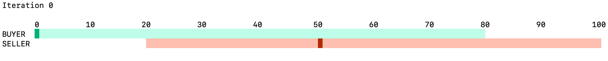
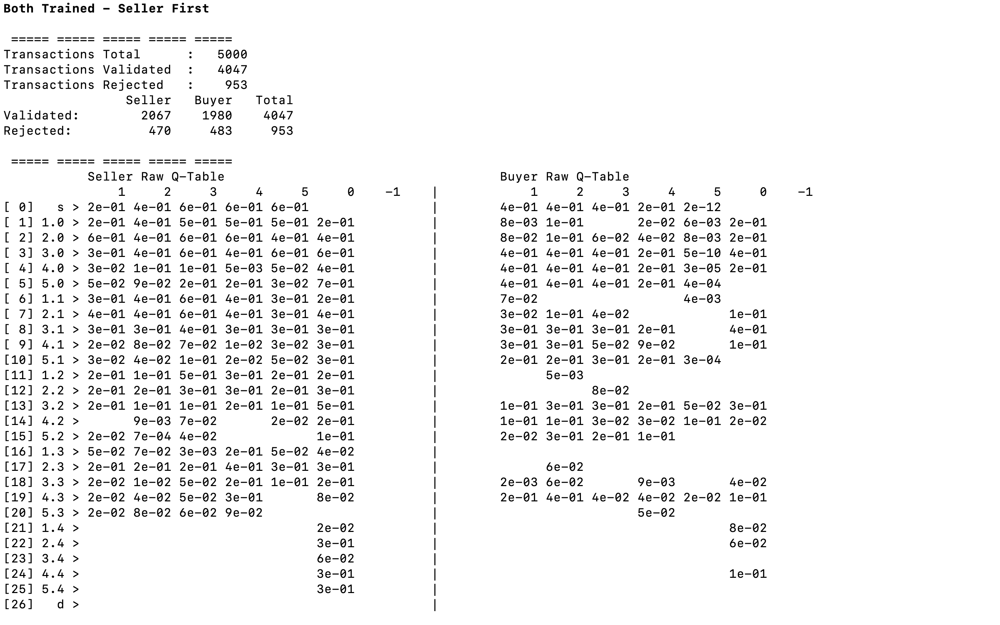
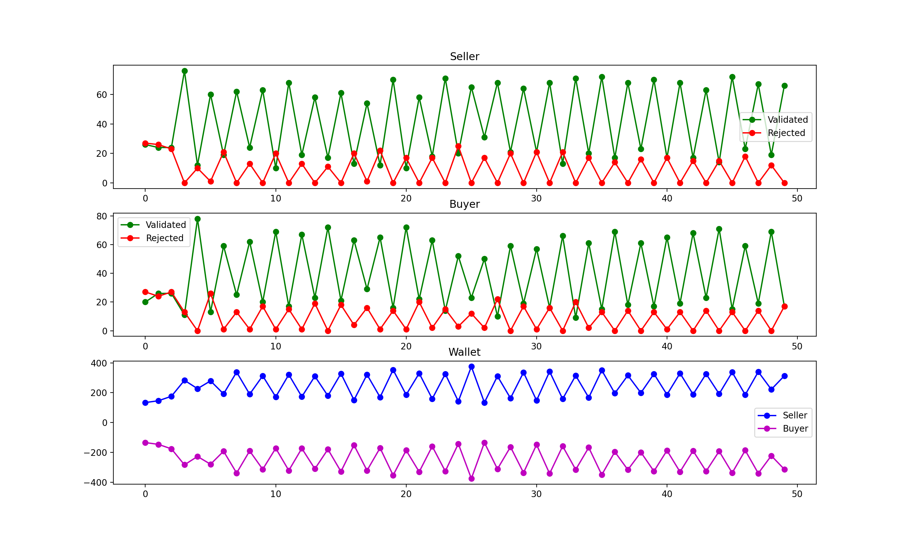
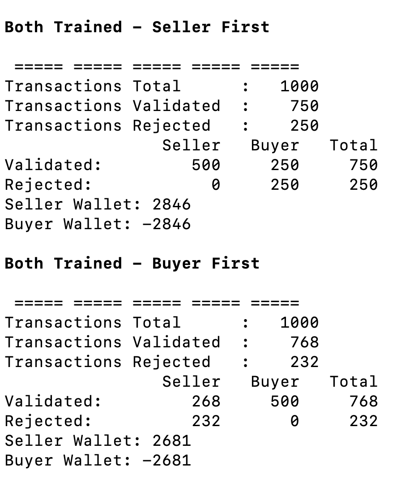
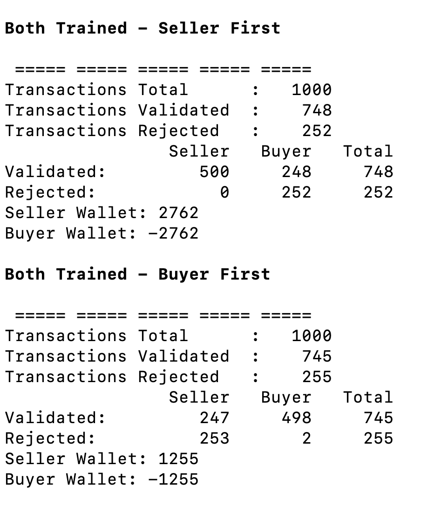

# Reinforcement Learning Negotiations

*[@AdrKacz](https://github.com/AdrKacz), [@mbeaufre](https://github.com/mbeaufre), Master Artificial Intelligence Ecole Centrale Lyon - Lyon 1*

*If you have any questions or issues, don't hesitate to contact us or to open an Issue or a Pull Request*

## Run the project

>Programs were tested on macOS and will work on Linux. If you do run on Windows ... well, at least please use a terminal that can display colour, or `./legacy/main.py` won't run otherwise.

```
git clone https://github.com/AdrKacz/IA-Negotiation.git
cd IA-Negotiation

# Static method
cd legacy
python3 main.py

# Dynamic method
cd rl-python
python3 -m venv .
source bin/activate
pip install -r requirements.txt
python3 main.py
```

# Problem

A **Seller** has to sell an item to a **Buyer**. The **Seller** wants to sell its item as expensive as possible, while the **Buyer** wants to buy it as cheap as possible.

We focus on optimising the strategy of the **Seller**, and the **Buyer**.

# Static method

An obvious way of tackling the problem will be to define different strategies for **Sellers** and **Agents** and to measure their performance in an **Environment**.

We implement such a way in the `./legacy` folder, but as you will see, we quickly gave up this approach.

We will use three objects:
- **Buyer** (*in `./legacy/buyer.py`*) that defines the **Buyer** strategy in its `act` function.
- **Seller** (*in `./legacy/seller.py`*) that defines the **Seller** strategy in its `act` function.
- **Environment** (*in `./legacy/environment.py`*) that makes the links between a **Buyer** and a **Seller** and print information in the terminal.

## Tool of visualisation

We use the `curses` library to print information in the terminal and refresh it.

We first wrap our `main` function in the `curses.wrapper` to safely get access our terminal screen

We then initialise the screen and the colour used in `./legacy/main.py`.

At every iteration, the seller acts, then the buyer acts, then the terminal is refreshed. There is a total of `10` iteration because, with the strategies defined, there is no need for more to find an agreement.

```py
for i in range(10):
  stdscr.getkey()
  # time.sleep(0.5)
  stdscr.addstr(0, 0, f'Iteration {i}\t')
  stdscr.refresh()

  seller.act()
  env.update()
  buyer.act()
  env.update()
  env.display()
```

```py
# Clear screen

curses.curs_set(0) # invisible cursor
curses.use_default_colors()
stdscr.clear()

scaled = lambda x: int(1000 * x / 255)
curses.use_default_colors()
curses.init_pair(0, 0, -1) # Base
curses.init_color(1, scaled(191), scaled(255), scaled(234)) # Light Green
curses.init_color(2, scaled(0), scaled(179), scaled(120)) # Green
curses.init_color(3, scaled(255), scaled(192), scaled(177)) # Light Red
curses.init_color(4, scaled(179), scaled(45), scaled(12)) # Red

curses.init_color(5, scaled(48), scaled(255), scaled(25)) # Flashy Light
curses.init_color(6, scaled(255), scaled(71), scaled(25)) # Flashy Red

curses.init_pair(1, -1, 1)
curses.init_pair(2, -1, 2)
curses.init_pair(3, -1, 3)
curses.init_pair(4, -1, 4)

curses.init_pair(5, 5, 6)
curses.init_pair(6, 6, -1)
```

**Environment** defines a `display` function that is in charge of printing the current state of the negotiation.

```py
def display(self, y_shift=1):
    # ...
    # Define function factor to print from left to right
    # ...

    # Metadata
    # ----- Scale
    for i in range(min_price, max_price + 1, 10):
        stdscr.addstr(y_shift + 1, local_transform(i) - len(str(i)) + 1, str(i), curses.color_pair(0))
    # ----- Label
    stdscr.addstr(y_shift + y_buyer, 0, 'BUYER', curses.color_pair(0))
    stdscr.addstr(y_shift + y_seller, 0, 'SELLER', curses.color_pair(0))
    # ----- Background
    min_buyer, max_buyer = local_transform(self.buyer.min_price), local_transform(self.buyer.max_price)
    stdscr.addstr(y_shift + y_buyer, min_buyer, (max_buyer - min_buyer) * ' ', curses.color_pair(1))

    min_seller, max_seller = local_transform(self.seller.min_price), local_transform(self.seller.max_price)
    stdscr.addstr(y_shift + y_seller, min_seller, (max_seller - min_seller) * ' ', curses.color_pair(3))

    # Buyer Price
    if self.buyer.price != None:
        x = local_transform(self.buyer.price)
        stdscr.addch(y_shift + y_buyer, x, ' ', curses.color_pair(2))

    # Seller price
    if self.seller.price != None:
        x = local_transform(self.seller.price)
        print(x, curses.COLS)
        stdscr.addstr(y_shift + y_seller, x, ' ', curses.color_pair(4))

    # Deal
    if self.deal:
        stdscr.addstr(y_shift, 0, f'DEAL at {self.seller.price}', curses.color_pair(5))

    stdscr.refresh()
```
`display` function is called at every iteration of the negotiation and displayed as below.



## Strategies

Both the  **Buyer** and the **Seller** have a *minimum acceptable price* and a *maximum acceptable price*.

### Buyer

**Buyer** make an offer that is the average of the offer made by the **Seller** and its *minimum acceptable price*. If the **Seller** hasn't made an offer yet, it simply gives its *minimum acceptable price*.

```py
# Look for desired price of the seller
seller_price = self.parent.seller.price
if self.price is None: # Initialise
    if seller_price != None:
        self.price = max(self.min_price, (self.min_price + seller_price) // 2)
    else:
        self.price = self.min_price
    return

# Price is defined
assert seller_price != None
self.price = max(self.min_price, (self.price + seller_price) // 2)
```

### Seller

**Seller** make an offer that is the average of the offer made by the **Buyer** and its *maximum acceptable price*. If the **Buyer** hasn't made an offer yet, it simply gives its *maximum acceptable price*.

```py
# Look for desired price of the buyer
buyer_price = self.parent.buyer.price
if self.price is None: # Initialise
    if buyer_price != None:
        self.price = min(self.max_price, (self.max_price + buyer_price) // 2)
    else:
        self.price = self.max_price
    return

# Price is defined
assert buyer_price != None
self.price = min(self.max_price, (self.price + buyer_price) // 2)
```

## Limitations

As expected, both the **Buyer** and the **Seller** act the way they are defined to act.

We don't have previous knowledge in negotiation strategies and thus cannot come up with interesting strategies to compare.

Moreover, the problem doesn't change if we add multiple **Buyers** and multiple **Sellers**. Indeed, after having found the one they want to negotiate with, we are reduced to the original problem. The negotiation can be closed earlier by one of the *Agents* to simulate the fact that they can switch between different *Agents* to negotiate a better price.

To obtain something interesting, we decided to not fix the strategies and instead to compute an optimal strategy.

# Dynamic method

We will use a Reinforcement Learning Algorithm to optimise the strategy of the **Buyer** and of the **Seller**.

All the following work is in the `./rl-python` folder.

## Limit the scope

We will implement the **[Q-Learning Algorithm](https://en.wikipedia.org/wiki/Q-learning)**. This algorithm is based on a representation of the *Environment* of the *Agent* as couples of *states* and *actions*.

For each *state*, there is an associated *reward* used to update the **Q-Table** of the *Agent* thanks to the **Bellman's Equation**.

```py
class Agent:
  def update_state(self, step_return):
      if self.last_action_index ==  None:
          raise ValueError('Cannot update Q-Table if no action has been made')


      new_state = step_return['new_state']
      # Update Q-table Q(state, action) -- Bellman's Equation
      self.q_table[self.state][self.last_action_index] = self.q_table[self.state][self.last_action_index] * (1 - self.learning_rate) + self.learning_rate * (step_return['reward'] + self.discount_rate * max(self.q_table[new_state]))

      self.state = new_state
```

The *Q-Table* holds the different *states* in its rows and the different *actions* in its columns. The index highest value in a row (corresponding to a *state*) is the index of the *action* to perform.

The objective is to determine, for each state, what is the best action to choose, to obtain the highest reward at the end.

So, we have to determine the **states**, the **actions**, and the **rewards** associate with each *state*.

### State Space

**Q-Learning Algorithm** enforces to have a finite number of *states*.

We choose to limit the number of different *price offers* (`price_space_size`) to **5** and the maximum number of exchanges between the *Buyer* and the *Seller* (`time_space_size`) to **5**.

So, negotiation is made up of **5** rounds. During *1* round, the **Seller** acts, then the **Buyer** acts, or vice versa.

There is an additional *final state*. This *state* is needed because the **Q-Learning Algorithm** only learn from the current state to the previous one. So, to learn if a transaction was successful, you need a state to end up after the transaction.

There is an *initial state*. This is *state* is the *state* an *agent* is in when it hasn't received any offer yet and has to make one.

That made up a total of `price_space_size x time_space_size + 1` *states*, so **5 x 5 + 1 = 26** *states*.

```py
class Environement():
  def __init__(self):
    # ...

    # Complexity : price_space_size = P , time_space_size = T
    self.price_space_size = 5
    self.time_space_size = 5

    # ...

    # States (P * T + 2)
    # price.time (for each price and for each time)
    # Start state s
    offer_states = [f'{price + 1}.{time}' for time in range(self.time_space_size) for price in range(self.price_space_size)]
    self.state_space = ['s'] + offer_states + ['d']

    # ...
  # ...
```

In **Q-Learning Algorithm**, *agents* explore multiple times all couples of *states* and *actions* to learn the best combination. So, the higher the number of *states* is, the more complicated it is to find a stable **Q-Table**.


### Action Space

Each *agent* can either make a new offer, within the `price_space_size`, accept the previous offer if any, and quit the transaction.

That makes up a total of **7** different actions.

```py
class Environement():
  def __init__(self):
    # ...

    # Complexity : price_space_size = P , time_space_size = T
    self.price_space_size = 5
    self.time_space_size = 5

    # Actions (P + 2)
    # 1 <= i <= n : offer ; 0 : accept : -1 : reject
    self.action_space = [i + 1 for i in range(self.price_space_size)] + [0, -1]

    self.action_space_size = len(self.action_space)

    # ...
  # ...
```

If the *agent* is in the *initial state*, it cannot accept or quit the transaction.

If the *agent* is in the last round of the transaction, it has to either accept the last offer or quit the transaction, it cannot make another offer.

```py
class Agent:
  #...
  def dynamic_action_space(self):
        # Must do an offer at first
        # Must accept or reject if last round
        from_action, to_action = 0, self.action_space_size
        if self.state == 0: # Start
            to_action -= 2 # Remove Validate and Reject
        elif self.state_space_size + 1 - self.action_space_size <= self.state < self.state_space_size - 1: # Last round
            from_action += self.action_space_size - 2 # Remove offer action

        return from_action, to_action
  # ...
```

### Rewards

**Seller** and **Buyer** have a different reward system.

*Agent* gains a *reward* when it accepts an offer or if its offer is accepted by *another agent*.

 **Seller** *reward* has the value of the price of the offer divided by `price_space_size`. So the higher the offer is, the higher the *reward* is.

 ```py
 class Seller(Agent):
   # ...
   def get_reward(self, step_return_without_reward):
       info = step_return_without_reward['info']
       if info.get('type') == 'validated':
           assert 1 <= info.get('offer', 0) <= 5
           return info['offer'] / 5
       return 0
  # ...
```

**Buyer** *reward* has the value of one minus the price of the offer divided by `price_space_size`. So the lower the offer is, the higher the *reward* is.

```py
class Buyer(Agent):
  # ...
  def get_reward(self, step_return_without_reward):
        info = step_return_without_reward['info']
        if info.get('type')  == 'validated':
            assert 1 <= info.get('offer', 0) <= 5
            return 1 - info['offer'] / 5
        return 0
 # ...
```

## Concurrent Q-Learning

One of the major problems to overcome is that there is no static environment.

Indeed, in a classic setup, there is one *agent*, that acts in an *environment*, and the *environment* stays the same and reacts to *agent's* actions.

However, here, the environment, of *one agent* is *another agent*. However, we don't know the optimal behaviour of *another agent* until it's trained.

So, we have to train both *agents* at the same time during the training phase.

However, while learning, **Q-Learning Algorithm** requires a certain amount of stability to evolve.

So, we decided to fix the *other agent* during a certain amount of negotiations training, and then switch. We have the *trainee* that is the *agent* that trained its **Q-Table** and the *trainer* that has a fixed **Q-Table** and behaves like a more classical *environment* will.

Two parameters control the length of the training:
- `num_cycles` is the number of switches performed between *trainee* and *trainer*
- `num_episodes` is the number of negotiations for each *cycle*.

```py
class Environment():
  def __init__(self):
    # Training Information
    self.num_cycles = int(5e1)
    self.num_episodes = int(1e2)

    # ...
    # Buyer and Seller
    self.buyer, self.seller = Buyer(), Seller()
  # ...
```

There are still two problems to solve:

1. After a *cycle*, the *trainee agent* will outperform *trainer agent*, thus in the *next cycle*, the *new trainee agent* (old *trainer agent*) will struggle to evolve in a too difficult environment. To overcome this, we store the **Q-Table** of the *trainee agent* before the *cycle* begins and use this **Q-Table** in the next *cycle* while *trainee* becomes *trainer*

2. The *agent* that starts will train its value for the *initial state* but never for the *states* of the last round. The same, the *agent* that doesn't start will never train its value for the *initial state* but will for the *states* of the last round. So, to train all values in the **Q-Tables**, we alternate for each *episode* (or *transaction*) the *agent* that starts.

```py
class Environment():
  # ...
  def train(...):
    # ...
    # Initialise Q-Tables
    # Define trainee and trainer
    #   trainee being either self.seller or self.buyer
    #   trainer begin the other one
    # ...
    for cycle in range(self.num_cycles):
      # ...
      for episode in range(self.num_episodes):
        # Reset
        # ...
        # Determine do the first offer
        is_trainer_first = episode % 2 == 0
        if is_trainer_first:
            trainer_first()
        for step in range(self.time_space_size):
            # Get Trainee action
          action_index = trainee.act()
          step_return = self.step(self.action_space[action_index], trainee)

          # ...
          # Check if the action terminates the transaction
          # ...

          # Get Trainer action
          action_index = trainer.exploit(overwrite_q_table=trainer_q_table)
          step_return = self.step(self.action_space[action_index], trainee)

          # Update Trainee states and Q-Tables
          trainee.update_state(step_return)

          # ...
          # Check if the action terminate the transaction    
          # ...
        # Q-Learning Algorithm Exploration Decay
        trainee.exploration_decay(episode)
        # ...
      # ...
      # Switch Trainee and Trainer
      trainer_q_table = deepcopy(trainer.q_table)
      trainee, trainer = trainer, trainee
      trainee_q_table, trainer_q_table = trainer_q_table, trainee_q_table
  # ...
```

### Training Parameters

The `train` function of the *environment* has multiple optional parameters.

- *verbose (`bool`):* whether or not to display global statistics in the terminal and the final **Q-Tables** of `self.seller` and `self.buyer`. Blank values in the **Q-Tables** are `null` or *untrained* values.

- *display_normalized (`bool`):* whether or not to display the normalized **Q-Tables** of `self.seller` and `self.buyer`. The normalized **Q-Tables** can be read more easily.

- *display_plot (`bool`):* whether or not to display as the graphs the statistics of the training.

- *train_both (`bool`):*  whether or not to train both the **Seller** and the **Buyer**. Useful to compare during *testing* if a *trained agent* overcome an *untrained agent*.

- *train_agent (`str`):* either `'Seller'` or `'Buyer'`. If `train_both` is enabled, define the `agent` that will be trained first (first *cycle* training). If `train_both` is disabled, define the `agent` to train.

### Testing **Q-Tables**

Testing is similar to the training. The only difference is that **Q-Tables** are not updated during the process.

## Results

In the code, the *states* are written as *price-of-the-offer-just-received.time-step*. *Initial state* is *s* and *final state* is *d*.

### Both agents trained, **Seller** first

We first trained both agents simultaneously, **Seller** first, then **Buyer** first.

We replace the content of `./rl-python/main.py` with:

```py
from environment import Environment

if __name__ == '__main__':
    environment = Environment()
    print('\n\033[1mBoth Trained - Seller First\033[0m')
    environment.train(verbose=True, display_plot=True, train_agent='Seller')
    environment.test()
```



With the global statistics, we notice that the number of validations is greater than the number of rejections. That makes sense because *agents* earn rewards on successful transactions.

As expected, the lower part of the **Q-Tables** is empty, indeed, *states* from *1.4* to *5.4* cannot lead to a new offer.



The plots are jittering up and down. This may seem strange but it's totally fine. Indeed, we switch which one is training and which one only use it **Q-Tables** each *cycle*.

Let's look at the first graph for example. The **Seller** starts, so it is trained when the *cycle* is **even**. When **Seller** is trained, we expect it to act more at random, and in a less optimised manner, so the number of validated offers should decrease (*as well as its wallet in the last graph*).

On the other hand, when **Seller** is the trainer, it only uses its **Q-Tables** so we expect it to optimise its actions, so the number of validated offers should get up (*as well as its wallet*).

This is exactly what we have, re-run the code in your environment if you are not sure about that.

However, the plot reveals problematic behaviour. Both *agents* seems to converge extremely quickly to a stable state (less than 10 *cycles*, so less than 1000 *episodes*). This is not expected. That reveals that our models may be oversimplified.

Nonetheless, the algorithm is working and we know we could extend it to a broader *action space*, *time-space*, and a larger number of *agents*.


### Both agents trained, switching the first

We now look if changing the *first agent* change something in the training.

```py
from environment import Environment

if __name__ == '__main__':
    environment = Environment()
    print('\n\033[1mBoth Trained - Seller First\033[0m')
    environment.train(verbose=True, display_plot=True, train_agent='Seller')
    environment.test()
```



We observe that the *first agent* to be trained is the *agent* that takes the win over time. Indeed, when **Seller** is trained first, it sells for **2846** whereas when **Buyer** is trained first, **Seller** sells for **2681 < 2846**. This pattern repeats each time you run the program.

Ideally, this shouldn't happen. Indeed, this means that we have a bias in the training. However, we have no idea how to solve it. Using different values of `num_cycles` and `num_episodes` doesn't change the problem.

On the other hand, we observe the most trained agent, as expected, beat the less trained agent. However this is not what we were looking for, so we will do the last comparison to check this assumption.

### Only one agent trained, switching the first

```py
from environment import Environment

if __name__ == '__main__':
    environment = Environment()
    print('\n\033[1mBoth Trained - Seller First\033[0m')
    environment.train(train_both=False, train_agent='Seller')
    environment.test()
    print('\n\033[1mBoth Trained - Buyer First\033[0m')
    environment.train(train_both=False, train_agent='Buyer')
    environment.test()
```



Exactly as expected, the *agent* trained outperforms the *agent* not trained. Indeed, when **Seller** is trained, it sells for **2762** whereas when **Buyer** is trained, **Seller** only sells for less than half, **1255**.

That is a very good result of the algorithm, and we could imagine further research using multiple *agents* trained differently.

## Conclusion

To simulate a negotiation, we had to go through various processes and understand clearly what is *the core of the problem*.

We rewrite the problem to *keep it as simple as possible*, and to be able to manage a more complex algorithm on it.

We had to rewrite the classic **Q-Learning Algorithm** and adapt it to our *Concurrent Learning* situation. Such adaptations were made by *DeepMind*, on a much larger scale, to train *AlphaGo*.

What was particularly understanding is how, by working on the subject, *we discovered new areas to look at**. Indeed, what was dark and without expectation first, becomes a *promising field* we had to stop our experimentations because of *time constraints*.

## Further Research

- Enlarge `price_space_size` and `time_space_size`, and see if new significant result appears.

 > *Potential Result:*  More complex strategy or impossibility to converge toward a stable **Q-Table**.

- Train a bunch of agents (both **Seller** and **Buyer**), with different learning parameters, and put them in a global room to negotiate together.

 - Give a common wallet to multiple agents.

 > *Potential Result:*  Simulate a mini marketplace with multi-actors and multi-wallets.

- Instead of limiting the number of transactions limit the number of time steps.

 > *Potential Result:*  Infer new behaviour, where closing a transaction earlier is a real improvement in the strategy.

- Use the visualisation made first in `./legacy` to display results of **Q-Learning**.

 > *Potential Result:*  More enjoyable observations.
