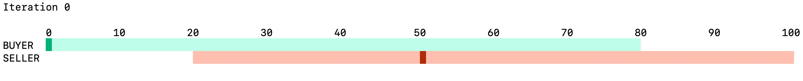

# Reinforcement Learning Negotiations

*[@AdrKacz](https://github.com/AdrKacz), [@mbeaufre](https://github.com/mbeaufre), Master Artificial Intelligence Ecole Centrale Lyon - Lyon 1*

## Run the project

```
git clone https://github.com/AdrKacz/IA-Negotiation.git
cd IA-Negotiation

# Static method
cd legacy
python3 main.py

# Dynamic method
cd rl-python
source bin/activate
python3 main.py
```

# Problem

A **Seller** has to sell an item to a **Buyer**. The **Seller** wants to sell its item as expensive as possible, while the **Buyer** wants to buy it as cheap as possible.

We focus on optimising the strategy of the **Seller**, and of the **Buyer**.

# Static method

An obvious way of tackling the problem will be to define different strategies for **Sellers** and **Agents** and to measure their performance in an **Environment**.

We implement such a way in the `.\legacy` folder, but as you will see, we quickly gave up this approach.

We will use three objects:
- **Buyer** (*in `.\legacy\buyer.py`*) that defines the **Buyer** strategy in its `act` function.
- **Seller** (*in `.\legacy\seller.py`*) that defines the **Seller** strategy in its `act` function.
- **Environment** (*in `.\legacy\environment.py`*) that makes the links between a **Buyer** and a **Seller** and print information in the terminal.

## Tool of visualisation

We use the `curses` library to print information in the terminal and refresh it.

We first wrap our `main` function in the `curses.wrapper` to safely get access our terminal screen

We then initialise the screen and the colour used in `.\legacy\main.py`.

At every iteration, the seller acts, then the buyer acts, then the terminal is refreshed. There is a total of `10` iteration because, with the strategies defined, there is no need for more to find an agreement.

```py
for i in range(10):
  stdscr.getkey()
  # time.sleep(0.5)
  stdscr.addstr(0, 0, f'Iteration {i}\t')
  stdscr.refresh()

  seller.act()
  env.update()
  buyer.act()
  env.update()
  env.display()
```

```py
# Clear screen

curses.curs_set(0) # invisible cursor
curses.use_default_colors()
stdscr.clear()

scaled = lambda x: int(1000 * x / 255)
curses.use_default_colors()
curses.init_pair(0, 0, -1) # Base
curses.init_color(1, scaled(191), scaled(255), scaled(234)) # Light Green
curses.init_color(2, scaled(0), scaled(179), scaled(120)) # Green
curses.init_color(3, scaled(255), scaled(192), scaled(177)) # Light Red
curses.init_color(4, scaled(179), scaled(45), scaled(12)) # Red

curses.init_color(5, scaled(48), scaled(255), scaled(25)) # Flashy Light
curses.init_color(6, scaled(255), scaled(71), scaled(25)) # Flashy Red

curses.init_pair(1, -1, 1)
curses.init_pair(2, -1, 2)
curses.init_pair(3, -1, 3)
curses.init_pair(4, -1, 4)

curses.init_pair(5, 5, 6)
curses.init_pair(6, 6, -1)
```

**Environment** defines a `display` function that is in charge of printing the current state of the negotiation.

```py
def display(self, y_shift=1):
    # ...
    # Define function factor to print from left to right
    # ...

    # Metadata
    # ----- Scale
    for i in range(min_price, max_price + 1, 10):
        stdscr.addstr(y_shift + 1, local_transform(i) - len(str(i)) + 1, str(i), curses.color_pair(0))
    # ----- Label
    stdscr.addstr(y_shift + y_buyer, 0, 'BUYER', curses.color_pair(0))
    stdscr.addstr(y_shift + y_seller, 0, 'SELLER', curses.color_pair(0))
    # ----- Background
    min_buyer, max_buyer = local_transform(self.buyer.min_price), local_transform(self.buyer.max_price)
    stdscr.addstr(y_shift + y_buyer, min_buyer, (max_buyer - min_buyer) * ' ', curses.color_pair(1))

    min_seller, max_seller = local_transform(self.seller.min_price), local_transform(self.seller.max_price)
    stdscr.addstr(y_shift + y_seller, min_seller, (max_seller - min_seller) * ' ', curses.color_pair(3))

    # Buyer Price
    if self.buyer.price != None:
        x = local_transform(self.buyer.price)
        stdscr.addch(y_shift + y_buyer, x, ' ', curses.color_pair(2))

    # Seller price
    if self.seller.price != None:
        x = local_transform(self.seller.price)
        print(x, curses.COLS)
        stdscr.addstr(y_shift + y_seller, x, ' ', curses.color_pair(4))

    # Deal
    if self.deal:
        stdscr.addstr(y_shift, 0, f'DEAL at {self.seller.price}', curses.color_pair(5))

    stdscr.refresh()
```
`display` function is called at every iteration of the negotiation and displayed as below.



## Strategies

Both the  **Buyer** and the **Seller** have a *minimum acceptable price* and a *maximum acceptable price*.

### Buyer

**Buyer** make an offer that is the average of the offer made by the **Seller** and its *minimum acceptable price*. If the **Seller** hasn't made an offer yet, it simply give it's *minimum acceptable price*.

```py
# Look for desired price of the seller
seller_price = self.parent.seller.price
if self.price is None: # Initialise
    if seller_price != None:
        self.price = max(self.min_price, (self.min_price + seller_price) // 2)
    else:
        self.price = self.min_price
    return

# Price is defined
assert seller_price != None
self.price = max(self.min_price, (self.price + seller_price) // 2)
```

### Seller

**Seller** make an offer that is the average of the offer made by the **Buyer** and its *maximum acceptable price*. If the **Buyer** hasn't made an offer yet, it simply give it's *maximum acceptable price*.

```py
# Look for desired price of the buyer
buyer_price = self.parent.buyer.price
if self.price is None: # Initialise
    if buyer_price != None:
        self.price = min(self.max_price, (self.max_price + buyer_price) // 2)
    else:
        self.price = self.max_price
    return

# Price is defined
assert buyer_price != None
self.price = min(self.max_price, (self.price + buyer_price) // 2)
```

## Limitations

As expected, both the **Buyer** and the **Seller** act the way they are defined to act.

We don't have previous knowledge in negotiation strategies, and thus cannot come up with interesting strategies to compare.

Moreover, the problem doesn't change if we add multiple **Buyers** and multiple **Sellers**. Indeed, after having found the one they want to negotiate with, we are reduced to the original problem. The negotiation can be closed earlier by one of the *Agent* to simulate the fact that they can switch between different *Agents* to negotiate better price.

To obtain something interesting, we decided to not fixed the strategies but instead to compute an optimal strategy.

# Dynamic method

We will use a Reinforcement Learning Algorithm to optimise the strategy of the **Buyer** and of the **Seller**.

## Limit the scope

We will implement the **[Q-Learning Algorithm](https://en.wikipedia.org/wiki/Q-learning)**. This algorithm is based on a representation of the *Environment* of the *Agent* as couples of *states* and *actions*.

For each *state*, there is an associated *reward* used to update the **Q-Table** of the *Agent* thanks to the **Bellman's Equation**.

The *Q-Table* holds the different *states* in its rows and the different *actions* in its columns. The index highest value in a row (corresponding to a *state*) is the index of the *action* to perform.

The objective is to determine, for each state, what is the best action to choose, to obtain the highest reward at the end.

So, we have to determine the **states**, the **actions**, and the **rewards** associate with each *state*.
